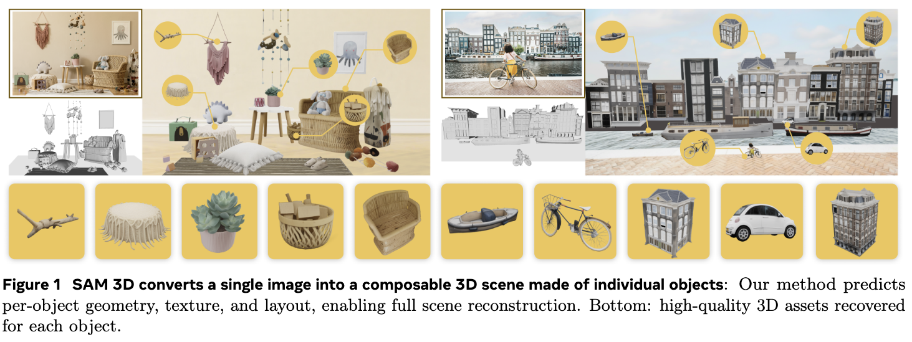
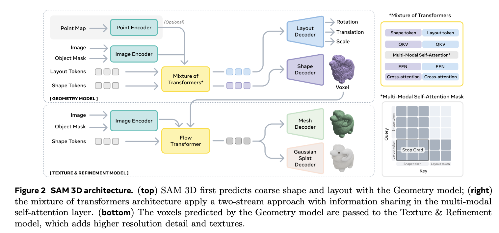

# SAM 3D

SAM 3D Objects is one part of SAM 3D, a pair of models for object and human mesh reconstruction.  If you’re looking for SAM 3D Body, [click here](https://github.com/facebookresearch/sam-3d-body).

# SAM 3D Objects

**SAM 3D Team**, [Xingyu Chen](https://scholar.google.com/citations?user=gjSHr6YAAAAJ&hl=en&oi=sra)\*, [Fu-Jen Chu](https://fujenchu.github.io/)\*, [Pierre Gleize](https://scholar.google.com/citations?user=4imOcw4AAAAJ&hl=en&oi=ao)\*, [Kevin J Liang](https://kevinjliang.github.io/)\*, [Alexander Sax](https://alexsax.github.io/)\*, [Hao Tang](https://scholar.google.com/citations?user=XY6Nh9YAAAAJ&hl=en&oi=sra)\*, [Weiyao Wang](https://sites.google.com/view/weiyaowang/home)\*, [Michelle Guo](https://scholar.google.com/citations?user=lyjjpNMAAAAJ&hl=en&oi=ao), [Thibaut Hardin](https://github.com/Thibaut-H), [Xiang Li](https://ryanxli.github.io/)⚬, [Aohan Lin](https://github.com/linaohan), [Jia-Wei Liu](https://jia-wei-liu.github.io/), [Ziqi Ma](https://ziqi-ma.github.io/)⚬, [Anushka Sagar](https://www.linkedin.com/in/anushkasagar/), [Bowen Song](https://scholar.google.com/citations?user=QQKVkfcAAAAJ&hl=en&oi=sra)⚬, [Xiaodong Wang](https://scholar.google.com/citations?authuser=2&user=rMpcFYgAAAAJ), [Jianing Yang](https://jedyang.com/)⚬, [Bowen Zhang](http://home.ustc.edu.cn/~zhangbowen/)⚬, [Piotr Dollár](https://pdollar.github.io/)†, [Georgia Gkioxari](https://georgiagkioxari.com/)†, [Matt Feiszli](https://scholar.google.com/citations?user=A-wA73gAAAAJ&hl=en&oi=ao)†§, [Jitendra Malik](https://people.eecs.berkeley.edu/~malik/)†§

***Meta Superintelligence Labs***

*Core contributor (Alphabetical, Equal Contribution), ⚬Intern, †Project leads, §Equal Contribution

[[`Paper`](https://ai.meta.com/research/publications/sam-3d-3dfy-anything-in-images/)] [[`Code`](https://github.com/facebookresearch/sam-3d-objects)] [[`Website`](https://ai.meta.com/sam3d/)] [[`Demo`](https://www.aidemos.meta.com/segment-anything/editor/convert-image-to-3d)] [[`Blog`](https://ai.meta.com/blog/sam-3d/)] [[`BibTeX`](#citing-sam-3d-objects)]

**SAM 3D Objects** is a foundation model that reconstructs full 3D shape geometry, texture, and layout from a single image, excelling in real-world scenarios with occlusion and clutter by using progressive training and a data engine with human feedback. It outperforms prior 3D generation models in human preference tests on real-world objects and scenes. We released code, weights, online demo, and a new challenging benchmark.


<p align="center"></p>

-----

<p align="center"></p>

## Latest updates

**11/19/2025** - Checkpoints Launched, Web Demo and Paper are out.

## Installation

Follow the [setup](doc/setup.md) steps before running the following.

## Single or Multi-Object 3D Generation

SAM 3D Objects can convert masked objects in an image, into 3D models with pose, shape, texture, and layout. SAM 3D is designed to be robust in challenging natural images, handling small objects and occlusions, unusual poses, and difficult situations encountered in uncurated natural scenes like this kidsroom:

<p align="center">
  
  
</p>

For a quick start, run `python demo.py` or use the the following lines of code:

```python
import sys

# import inference code
sys.path.append("notebook")
from inference import Inference, load_image, load_single_mask

# load model
tag = "hf"
config_path = f"checkpoints/{tag}/pipeline.yaml"
inference = Inference(config_path, compile=False)

# load image and mask
image = load_image("notebook/images/shutterstock_stylish_kidsroom_1640806567/image.png")
mask = load_single_mask("notebook/images/shutterstock_stylish_kidsroom_1640806567", index=14)

# run model
output = inference(image, mask, seed=42)

# export gaussian splat
output["gs"].save_ply(f"splat.ply")
```

For  more details and multi-object reconstruction, please take a look at out two jupyter notebooks:
* [single object](notebook/demo_single_object.ipynb)
* [multi object](notebook/demo_multi_object.ipynb)


## SAM 3D Body

[SAM 3D Body (3DB)](https://github.com/facebookresearch/sam-3d-body) is a robust promptable foundation model for single-image 3D human mesh recovery (HMR).

As a way to combine the strengths of both **SAM 3D Objects** and **SAM 3D Body**, we provide an example notebook that demonstrates how to combine the results of both models such that they are aligned in the same frame of reference. Check it out [here](notebook/demo_3db_mesh_alignment.ipynb).

## License

The SAM 3D Objects model checkpoints and code are licensed under [SAM License](./LICENSE).

## Contributing

See [contributing](CONTRIBUTING.md) and the [code of conduct](CODE_OF_CONDUCT.md).

## Contributors

The SAM 3D Objects project was made possible with the help of many contributors.

Robbie Adkins,
Paris Baptiste,
Karen Bergan,
Kai Brown,
Michelle Chan,
Ida Cheng,
Khadijat Durojaiye,
Patrick Edwards,
Daniella Factor,
Facundo Figueroa,
Rene  de la Fuente,
Eva Galper,
Cem Gokmen,
Alex He,
Emmanuel Hernandez,
Dex Honsa,
Leonna Jones,
Arpit Kalla,
Kris Kitani,
Helen Klein,
Kei Koyama,
Robert Kuo,
Vivian Lee,
Alex Lende,
Jonny Li,
Kehan Lyu,
Faye Ma,
Mallika Malhotra,
Sasha Mitts,
William Ngan,
George Orlin,
Peter Park,
Don Pinkus,
Roman Radle,
Nikhila Ravi,
Azita Shokrpour,
Jasmine Shone,
Zayida Suber,
Phillip Thomas,
Tatum Turner,
Joseph Walker,
Meng Wang,
Claudette Ward,
Andrew Westbury,
Lea Wilken,
Nan Yang,
Yael Yungster


## Citing SAM 3D Objects

If you use SAM 3D Objects in your research, please use the following BibTeX entry.

< TODO: Add bibtex here >
